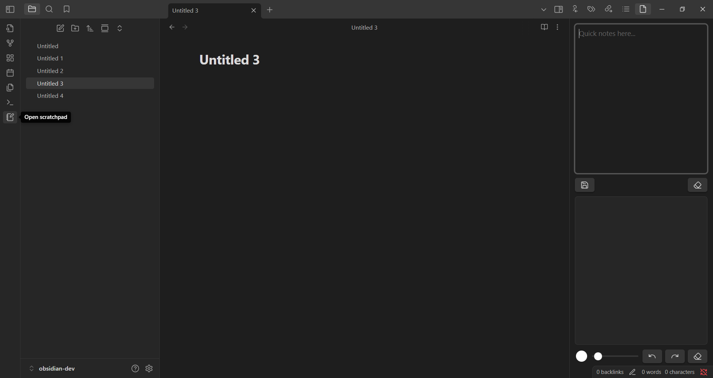

# Scratchpad

**Scratchpad** is an Obsidian plugin that provides a simple space in the sidebar for quick text notes and freehand drawings — perfect for jotting down ideas while working across multiple notes.

## Features

-  A text input area for quick notes
-  A canvas for freehand drawing with customizable brush color and size
-  Content can be saved to disk
-  Lightweight and distraction-free

## Installation

1. In Obsidian, open **Settings → Community Plugins**.
2. Make sure Safe Mode is turned off to enable plugin installation
3. Click Browse, then search for **"Scratchpad"** or open directly:  
    **obsidian://show-plugin?id=scratchpad**
4. Click Install, then Enable the plugin.

## Usage

1. Open the command palette (`Ctrl/Cmd + P`) and search for `Scratchpad`, or click the notebook-pen icon in the left ribbon.
2. The plugin opens in the right sidebar.
3. The top section is a text area where you can type quick notes (Markdown is not rendered).
4. The bottom section is a canvas where you can draw using your mouse or stylus.
5. Use the toolbar to:
   - Pick brush color
   - Adjust brush size
   - Clear the canvas
   - Save the content

> [!NOTE]
> - This is a temporary note — your content is stored in memory and will be lost when the app is closed unless you manually save it to disk.
> - Scratchpad **does not support multiple notes**.

Read the blog at https://bit.ly/4exb8PZ.

## License

MIT
